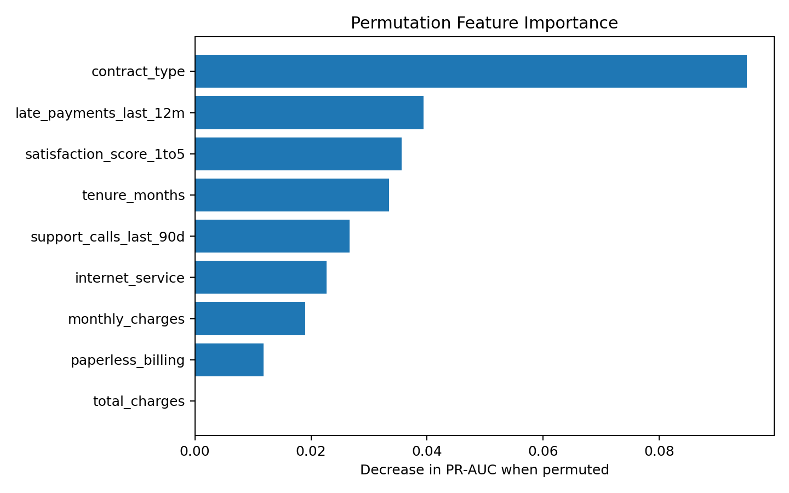
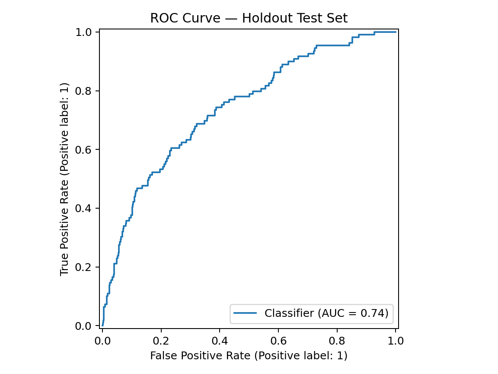
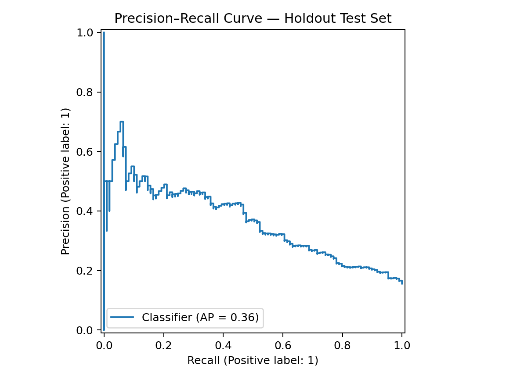
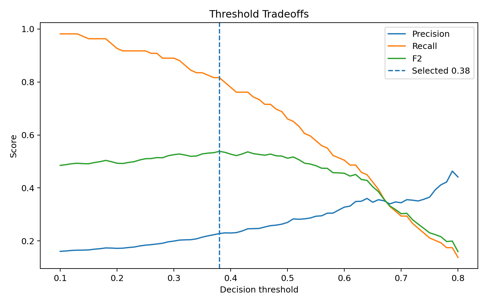
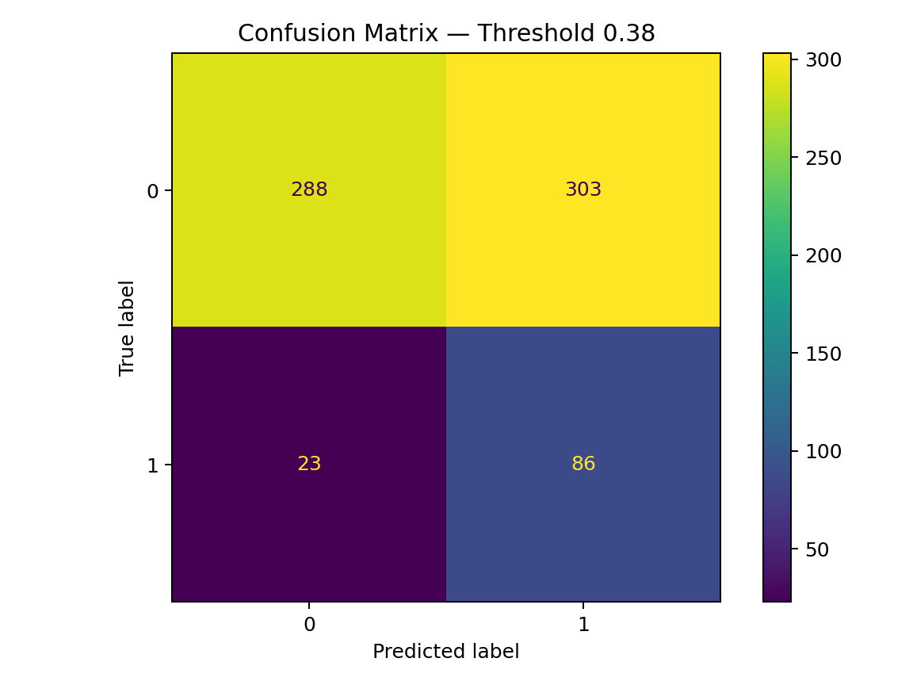

# Telecom Customer Churn Prediction — End-to-End Machine Learning

> **Portfolio case study:** identify telecom customers at elevated churn risk, optimize the decision threshold for retention outreach, explain the model, and translate predictions into an estimated business outcome.

## Executive Summary

Customer churn is an imbalanced classification problem where high accuracy can hide poor detection of the customers the business actually needs to reach. This project builds a reproducible churn pipeline across **3,500 synthetic telecom customer records**, compares three classification approaches, selects an interpretable logistic regression model, tunes the operating threshold on a validation set, and evaluates performance once on an untouched holdout test set.

At the selected **0.38 business threshold**, the holdout model identifies approximately **78.9% of actual churners**, compared with the original project's low-recall 0.50-threshold setup. The project also estimates retention campaign economics, exports customer-level risk scores, provides explainability outputs, and includes a Streamlit scoring application.

## Why This Project Is Different

A standard churn notebook often stops after fitting a classifier and reporting accuracy. This project treats churn prediction as a small production-style data science engagement:

- reproducible data and training pipeline;
- stratified train / validation / test separation;
- 5-fold cross-validation;
- Logistic Regression, Random Forest, and HistGradientBoosting comparison;
- ROC-AUC **and** PR-AUC for imbalanced evaluation;
- validation-only threshold tuning using F2 and a precision constraint;
- holdout test evaluation after threshold selection;
- confusion matrix and precision/recall tradeoff visualization;
- logistic coefficient and permutation-importance explainability;
- customer-level risk scoring and risk bands;
- simple retention ROI simulation;
- persisted model artifact with threshold metadata;
- Streamlit demo application;
- pytest test suite and GitHub Actions CI configuration;
- model card, data dictionary, and business recommendations.

## Business Problem

A telecom retention team has limited time and incentive budget. The goal is not simply to classify every customer correctly; it is to identify enough likely churners early enough to intervene without creating an impractical outreach list.

**Primary question:** Which customers should the retention team prioritize for proactive outreach?

**Analytical objective:** maximize useful churn detection while maintaining an acceptable precision level and quantifying the resulting campaign economics.

## Dataset

The included dataset is a **deterministic synthetic dataset** designed for portfolio demonstration and reproducibility.

| Attribute | Value |
|---|---:|
| Rows | 3,500 |
| Target | `churned` |
| Churn rate | 15.6% |
| Numeric predictors | 6 |
| Categorical predictors | 3 |
| Customer identifier used in model? | No |

Features cover tenure, charges, contract type, internet service, paperless billing, support contacts, late payments, and satisfaction. See [`data/data_dictionary.md`](data/data_dictionary.md).

## Methodology

### 1. Data validation and EDA

The workflow checks schema, target balance, descriptive statistics, and churn patterns across actionable customer attributes. `customer_id` is retained only for final scoring output and excluded from modeling.

### 2. Leakage-safe preprocessing

A scikit-learn `ColumnTransformer` applies:

- `StandardScaler` to numeric fields;
- `OneHotEncoder(handle_unknown="ignore")` to categorical fields.

Preprocessing lives inside each model pipeline, preventing transformations from being fitted on holdout data.

### 3. Model comparison

Three models are benchmarked:

| Model | Validation ROC-AUC | Validation PR-AUC | 5-Fold CV ROC-AUC | 5-Fold CV PR-AUC |
|---|---:|---:|---:|---:|
| **Logistic Regression** | **0.716** | **0.330** | **0.735** | **0.355** |
| Random Forest | 0.678 | 0.285 | 0.693 | 0.296 |
| HistGradientBoosting | 0.682 | 0.261 | 0.676 | 0.291 |

Logistic Regression is retained because it provides the strongest validation/CV discrimination in this experiment while remaining easy to explain to business stakeholders.

### 4. Threshold optimization

A default classifier threshold of `0.50` is not automatically the best business operating point. Thresholds from `0.10` to `0.80` are evaluated on the validation set.

The selected threshold is **0.38**, chosen using **F2 score**—which weights recall more heavily than precision—while enforcing a minimum precision requirement.

### 5. Final holdout evaluation

After threshold selection, the model is refit on all non-test data and evaluated once on the untouched test set.

| Metric | Default 0.50 | Business 0.38 |
|---|---:|---:|
| ROC-AUC | 0.741 | 0.741 |
| PR-AUC | 0.364 | 0.364 |
| Accuracy | 0.681 | 0.534 |
| Precision | 0.282 | 0.221 |
| **Recall** | **0.679** | **0.789** |
| F1 | 0.399 | 0.345 |
| F2 | 0.530 | 0.521 |
| True churners identified | 74 | **86** |
| Churners missed | 35 | **23** |

The lower accuracy at the business threshold is intentional. In an imbalanced churn problem, accuracy rewards correctly predicting the large non-churn class. The 0.38 threshold instead increases the number of true churners surfaced to the retention team.

## Business Impact Simulation

The included simulation uses transparent, editable assumptions:

- retention contact cost: **$12** per targeted customer;
- retained-customer value: **$450**;
- save rate after contacting a true churner: **30%**.

On the 700-row holdout set:

| Scenario | Customers Contacted | True Churners Reached | Expected Saves | Est. Net Value |
|---|---:|---:|---:|---:|
| Threshold 0.50 | 262 | 74 | 22.2 | $6,846 |
| **Business threshold 0.38** | **389** | **86** | **25.8** | **$6,942** |

This is a scenario analysis, not a claim of realized ROI. In production, save rate and retained value should come from controlled experiments and finance-approved assumptions.

## Explainability

Two complementary approaches are exported:

1. **Logistic coefficients / odds ratios** for transparent directional interpretation.
2. **Permutation importance** using PR-AUC to measure how much predictive performance declines when each original feature is disrupted.

Interpretability results are associations, not causal effects.



## Evaluation Visuals

### ROC Curve


### Precision–Recall Curve


### Threshold Tradeoffs


### Business-Threshold Confusion Matrix


## Repository Structure

```text
01_telecom_churn_prediction_10of10/
├── .github/workflows/ci.yml
├── data/
│   ├── telecom_churn.csv
│   ├── data_dictionary.md
│   └── README.md
├── deployment/
│   ├── app_streamlit.py
│   └── README.md
├── figures/
│   ├── confusion_matrix.png
│   ├── feature_importance.png
│   ├── precision_recall_curve.png
│   ├── roc_curve.png
│   └── threshold_tradeoffs.png
├── models/
│   └── churn_model.joblib
├── notebooks/
│   ├── 01_eda.ipynb
│   ├── 02_model_comparison.ipynb
│   ├── 03_threshold_business_analysis.ipynb
│   └── 04_explainability.ipynb
├── reports/
│   ├── business_case.json
│   ├── business_recommendations.md
│   ├── customer_risk_scores.csv
│   ├── logistic_coefficients.csv
│   ├── metrics.json
│   ├── model_card.md
│   ├── model_comparison.csv
│   ├── permutation_importance.csv
│   └── threshold_analysis.csv
├── src/
│   ├── __init__.py
│   ├── generate_data.py
│   └── modeling.py
├── tests/
│   ├── conftest.py
│   └── test_pipeline.py
├── .gitignore
├── LICENSE
├── Makefile
├── README.md
├── requirements.txt
└── run_pipeline.py
```

## Reproduce the Project

```bash
python -m venv .venv
source .venv/bin/activate       # Windows: .venv\Scripts\activate
pip install -r requirements.txt
python src/generate_data.py
python run_pipeline.py
pytest -q
```

The pipeline recreates the model, metrics, reports, risk scores, and all evaluation figures.

## Run the Streamlit App

```bash
streamlit run deployment/app_streamlit.py
```

The app loads the persisted model and the same business threshold selected during model development.

## Key Business Recommendations

1. Score the customer base on a recurring cadence and rank customers by churn probability.
2. Use threshold-based outreach when the retention team has broad capacity; use top-risk ranking when capacity is fixed.
3. Focus retention experiments on actionable drivers such as contract structure, support friction, payment behavior, pricing pressure, and satisfaction.
4. Track campaign **incremental lift and net retained value**, not merely classifier accuracy.
5. Monitor model performance, calibration, data drift, and subgroup outcomes before any real deployment.

## Limitations and Next Steps

This is a synthetic portfolio dataset, so the model is a demonstration of methodology rather than a production telecom model. A real implementation should add temporal validation, probability calibration, experiment-based causal measurement, subgroup/fairness checks, drift monitoring, data contracts, feature-store/versioning controls, and an inference API or managed deployment pipeline.

## Skills Demonstrated

`Python` · `pandas` · `NumPy` · `scikit-learn` · `classification` · `imbalanced learning` · `cross-validation` · `ROC-AUC` · `PR-AUC` · `threshold optimization` · `feature engineering` · `model explainability` · `business analytics` · `Streamlit` · `pytest` · `GitHub Actions` · `ML documentation`

---

**Author:** Jamie Christian  
**Project type:** End-to-end data science / machine learning portfolio case study
