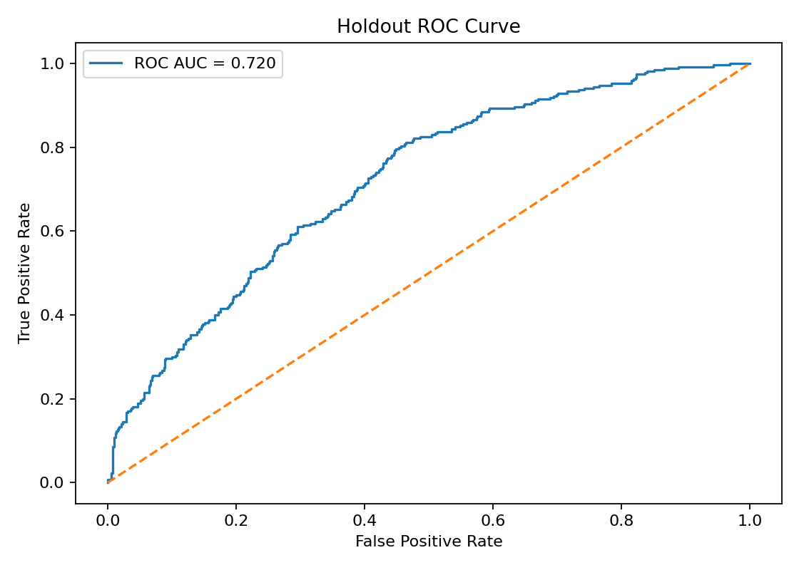
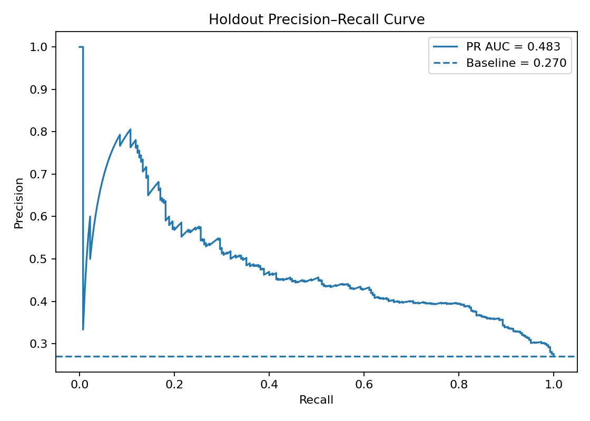
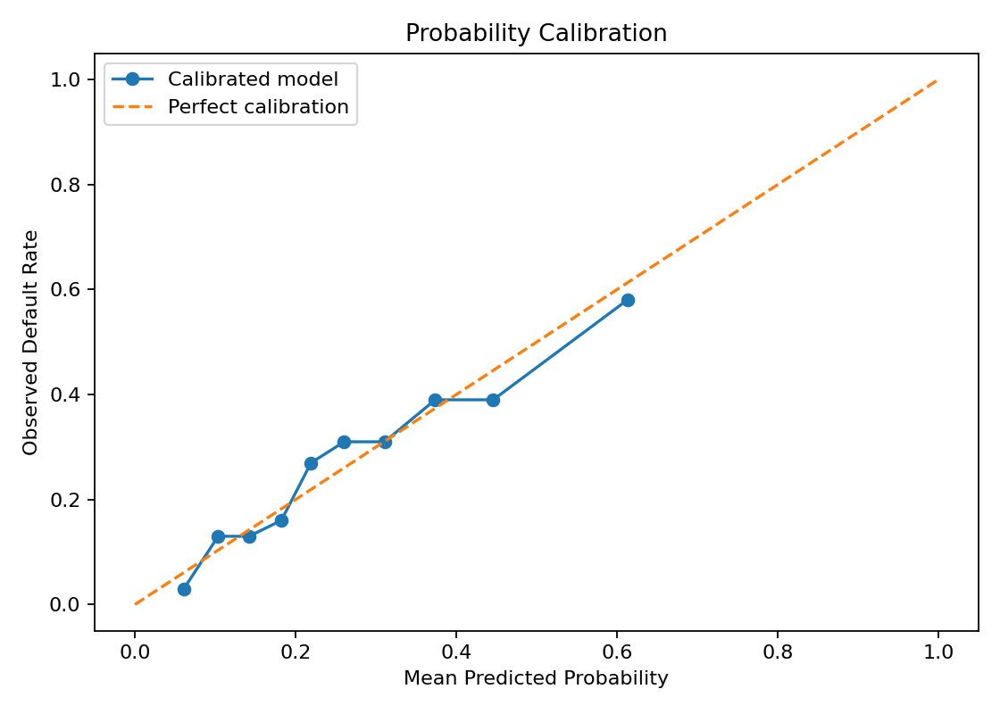
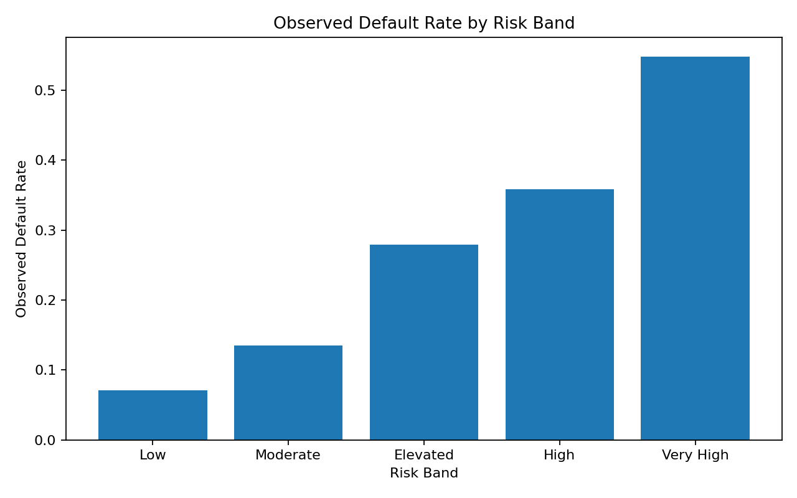
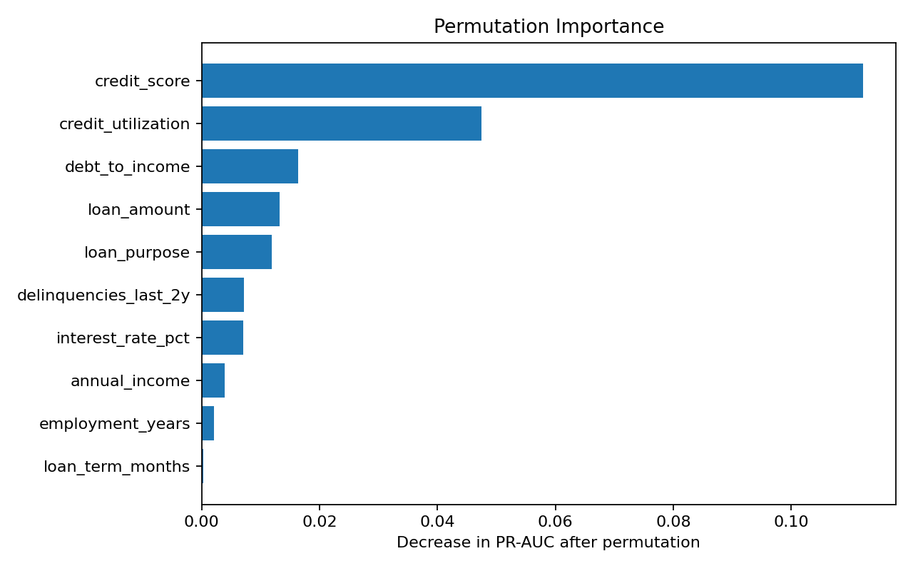
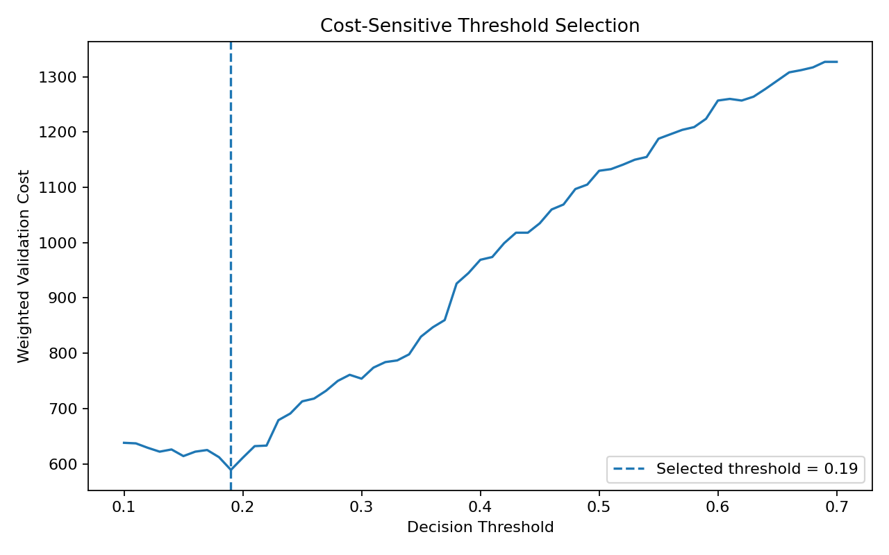

# Credit Risk: Loan Default Prediction & Decision Support

**End-to-end data science portfolio project covering probability of default, model comparison, calibration, cost-sensitive thresholding, explainability, risk bands, business analysis, governance, monitoring, testing and deployment.**

> **Portfolio disclaimer:** The included 5,000-row dataset is deterministic **synthetic data** modeled on the schema and approximate 26.7% default rate documented in the original project. This repository is educational and must not be used for real lending decisions.

## Executive Summary

This project builds a reproducible probability-of-default workflow for consumer loan applications. Rather than optimizing headline accuracy, the project evaluates ranking quality, minority-class performance, probability calibration, and the business tradeoff between missed defaults and false risk alerts.

The final workflow compares **Logistic Regression, Random Forest, and HistGradientBoosting**, selects a model using validation **PR-AUC**, calibrates predicted probabilities, chooses an operating threshold using a transparent validation cost function, and evaluates the frozen decision rule exactly once on an untouched holdout set.

## Holdout Results

| Metric | Result |
|---|---:|
| ROC-AUC | **0.720** |
| PR-AUC | **0.483** |
| Recall | **0.848** |
| Precision | **0.365** |
| F1 | **0.510** |
| F2 | **0.670** |
| Brier score | **0.174** |
| KS statistic | **0.348** |
| Selected threshold | **0.19** |

The threshold is selected on **validation data**, with missed defaults weighted 5× more heavily than false-positive risk alerts. This is a demonstration business assumption, not a real bank policy.







## Why This Version Is Stronger Than an Accuracy-Only Model

The original project documented **72.9% accuracy but only 10.5% recall**, meaning most actual defaults were missed at the default 0.50 cutoff. This upgraded workflow treats threshold selection as a business decision and makes the tradeoff explicit.

The project also adds:
- stratified model comparison;
- calibrated probability-of-default estimates;
- PR-AUC and KS alongside ROC-AUC;
- Brier score and calibration analysis;
- cost-sensitive threshold optimization;
- risk-band validation;
- permutation importance;
- expected-loss demonstration;
- model card and monitoring plan;
- fair-lending/governance discussion;
- Streamlit scoring demo;
- automated tests and GitHub Actions CI.

## Repository Structure

```text
02_credit_risk_default_prediction/
├── data/
│   └── credit_risk.csv
├── deployment/
│   ├── app.py
│   └── README.md
├── figures/
│   ├── calibration_curve.png
│   ├── permutation_importance.png
│   ├── precision_recall_curve.png
│   ├── risk_band_default_rate.png
│   ├── roc_curve.png
│   └── threshold_cost_curve.png
├── models/
│   └── credit_risk_model.joblib
├── notebooks/
│   ├── 01_data_validation_eda.ipynb
│   ├── 02_modeling_cross_validation.ipynb
│   ├── 03_calibration_threshold_business.ipynb
│   └── 04_explainability_governance.ipynb
├── reports/
│   ├── business_impact.json
│   ├── cross_validation.json
│   ├── data_dictionary.md
│   ├── governance_and_fair_lending.md
│   ├── holdout_scored_applicants.csv
│   ├── metrics.json
│   ├── model_card.md
│   ├── model_comparison.csv
│   ├── monitoring_plan.md
│   ├── permutation_importance.csv
│   ├── risk_band_summary.csv
│   └── threshold_analysis.csv
├── src/
│   └── credit_risk_pipeline.py
├── tests/
│   └── test_pipeline.py
├── .github/workflows/tests.yml
├── Makefile
├── requirements.txt
└── run_pipeline.py
```

## Modeling Workflow

1. Validate schema and target.
2. Preserve a stratified 20% holdout set.
3. Split the remaining data into training and validation.
4. Compare candidate models with consistent preprocessing.
5. Select based primarily on validation PR-AUC.
6. Calibrate probabilities.
7. Select a cost-sensitive operating threshold using validation data only.
8. Refit/calibrate using the full train/validation development sample.
9. Evaluate once on the untouched holdout sample.
10. Segment probabilities into demonstration risk bands and create monitoring artifacts.

## Risk Bands

The repository includes five descriptive probability bands:

| PD | Band |
|---|---|
| < 10% | Low |
| 10–20% | Moderate |
| 20–30% | Elevated |
| 30–45% | High |
| ≥ 45% | Very High |

These are **analytical bands**, not lending rules.



## Explainability

Permutation importance is calculated on the holdout data using PR-AUC as the scoring function.



Interpretation is intentionally separated from causation: a strong predictive feature is not automatically a valid policy lever or permissible underwriting variable.

## Business Cost Analysis

For demonstration, the threshold optimizer weights:
- false negative / missed default = **5**
- false positive / false risk alert = **1**

This creates a transparent cost function rather than hiding the decision inside a 0.50 cutoff.



The repository also computes a simple expected-loss illustration using:

`Expected Loss = PD × Exposure × LGD`

with a demonstration LGD of 45%.

## Responsible Modeling

Credit modeling is high-stakes. A real implementation would require formal model validation, legal and compliance review, fair-lending testing, adverse-action processes, data governance, independent model-risk oversight, monitoring, explainability, security controls and human escalation.

Protected characteristics are intentionally absent from the synthetic dataset. Their absence does **not** prove a model is fair.

See:
- `reports/governance_and_fair_lending.md`
- `reports/model_card.md`
- `reports/monitoring_plan.md`

## Reproduce the Project

```bash
python -m venv .venv
source .venv/bin/activate   # Windows: .venv\Scripts\activate
pip install -r requirements.txt
python run_pipeline.py
pytest -q
```

## Run the Demo

```bash
streamlit run deployment/app.py
```

The app estimates synthetic default risk and displays a descriptive risk band. It is not an underwriting engine.

## Interview Talking Points

- Why accuracy can be misleading in default prediction.
- Why PR-AUC complements ROC-AUC for a minority default class.
- Why threshold tuning must happen outside the final test set.
- Why calibrated probabilities matter when estimating probability of default.
- How false-negative and false-positive costs change the optimal operating point.
- Why risk-band observed default rates are useful for validation and monitoring.
- Why predictive performance alone is insufficient for a real credit model.
- How model governance, fair-lending review and ongoing monitoring fit into the ML lifecycle.

## Skills Demonstrated

Python · pandas · NumPy · scikit-learn · classification · class imbalance · cross-validation · probability calibration · ROC-AUC · PR-AUC · KS statistic · Brier score · threshold optimization · confusion matrices · permutation importance · risk segmentation · expected loss · Streamlit · pytest · GitHub Actions · reproducible ML pipelines · responsible AI / model governance

## Author

**Jamie Christian**  
Data Science Portfolio
