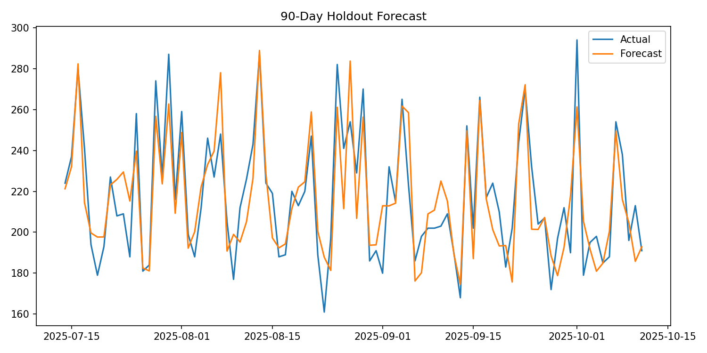

# Retail Demand Forecasting & Inventory Planning

Portfolio-grade time-series project with leakage-safe lag features, seasonal baseline comparison, rolling backtests, forecast bias, WMAPE, and inventory-cost analysis.

> Synthetic portfolio dataset covering the same 2024-01-01 to 2025-10-11 period as the original project.

## Holdout Results
- MAE: **13.28**
- RMSE: **16.36**
- MAPE: **6.20%**
- WMAPE: **6.12%**
- Seasonal-naive WMAPE: **13.23%**
- Bias: **-1.28 units**



## 10/10 Portfolio Additions
Time-based validation, seasonal baseline, rolling-origin backtests, inventory impact, monitoring plan, reproducible pipeline, Streamlit dashboard, tests and CI.

## Reproduce
```bash
pip install -r requirements.txt
python run_pipeline.py
pytest -q
streamlit run deployment/app.py
```
