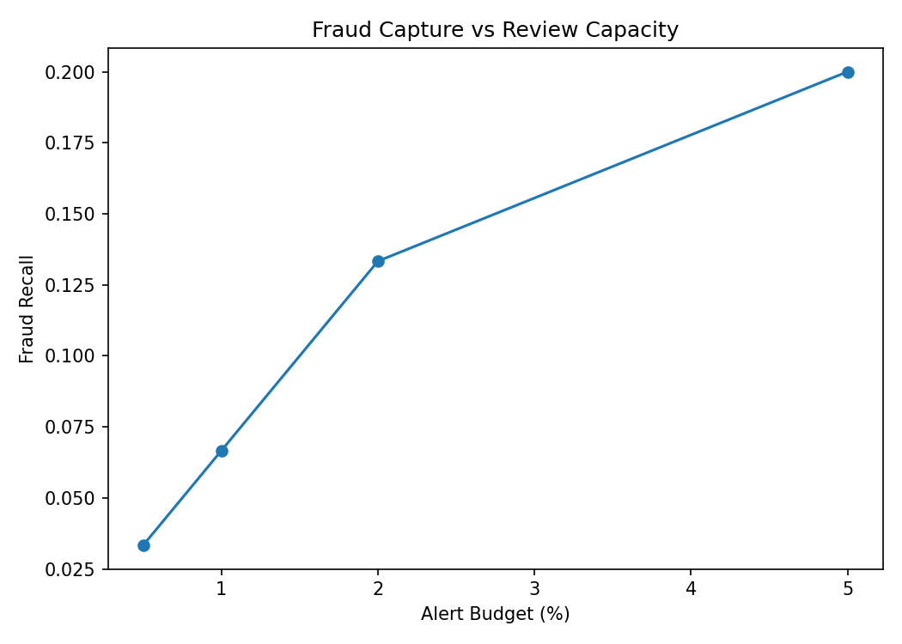

# Credit Card Fraud Detection & Investigation Prioritization

Portfolio-grade fraud system using supervised ranking, unsupervised anomaly detection, chronological evaluation, and review-capacity optimization.

> Synthetic 30,000-transaction dataset; fraud rate **0.430%**.

## Holdout Results
- ROC-AUC: **0.622**
- PR-AUC: **0.017**
- Precision at top 1%: **0.033**
- Recall at top 1%: **0.067**
- Isolation Forest ROC-AUC: **0.540**



## 10/10 Portfolio Additions
Time-based holdout, PR-AUC, Precision@K, Recall@K, fraud-dollar capture, false-alert analysis, supervised + anomaly models, model card, monitoring, Streamlit queue, tests and CI.

## Reproduce
```bash
pip install -r requirements.txt
python run_pipeline.py
pytest -q
streamlit run deployment/app.py
```
