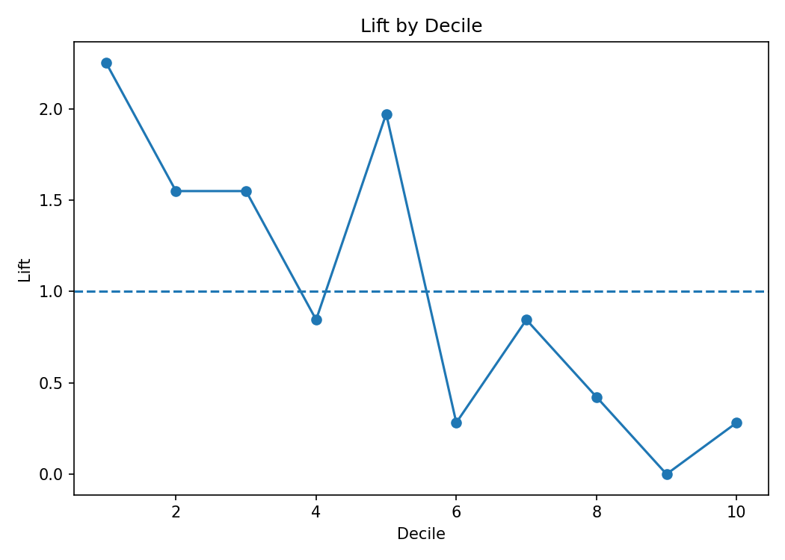

# Marketing Campaign Optimization: Propensity, Lift & Uplift

Portfolio-grade campaign targeting project focused on ranking, lift, gains, uplift concepts, and ROI rather than a default 0.50 threshold.

> Synthetic 9,000-customer dataset with randomized treatment for educational uplift analysis.

## Holdout Results
- Response rate: **3.96%**
- ROC-AUC: **0.696**
- PR-AUC: **0.081**
- Top-decile response rate: **8.89%**
- Top-decile lift: **2.25×**
- Recall in top 10% targeted: **22.54%**



## 10/10 Portfolio Additions
Lift by decile, top-K targeting, uplift T-learner, treatment/control analysis, campaign ROI, monitoring, reproducible pipeline, Streamlit demo, tests and CI.

## Reproduce
```bash
pip install -r requirements.txt
python run_pipeline.py
pytest -q
streamlit run deployment/app.py
```
