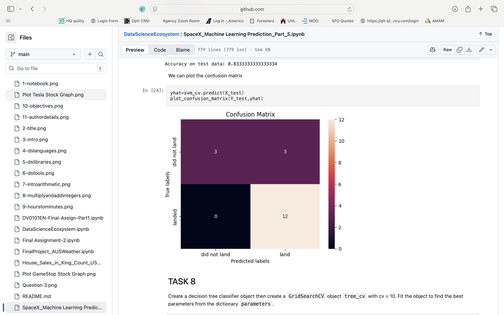

# 🧠 Jamie Christian — Data Science Portfolio (2025 Edition)


Welcome to my **Data Science Portfolio**, a curated collection of projects and notebooks demonstrating real-world data analysis, machine learning, and visualization techniques.  
Each project showcases the end-to-end data workflow — from **data preparation and feature engineering** to **modeling, evaluation, and insight communication**.

> 🎯 **Goal:** To transform raw data into actionable insights using modern analytical tools and reproducible workflows.  
> 🧰 **Core Stack:** Python, Pandas, NumPy, Matplotlib, Plotly, Scikit-Learn, SQL, Jupyter, Power BI.

---

## 🗂 Repository Structure

```
data-science-portfolio/
├── notebooks/          # Jupyter notebooks for EDA, ML, and API projects
├── data_files/         # CSV / Excel datasets (some ignored via .gitignore)
├── Visuals/            # Generated visuals, charts, and model images
├── reports_package/    # Summaries, insights, and deliverable reports
└── README.md           # You are here
```

---

## 🚀 Featured Projects

| Project | Description | Key Skills |
|----------|--------------|-------------|
| **SpaceX Machine Learning Prediction** | Predicts Falcon 9 first stage landing success using classification models (SVM, KNN, Decision Tree, Elastic-Net). | ML, Data Wrangling, Feature Engineering |
| **AUSWeather Project** | Predicts Australian weather patterns using meteorological data. | Regression, EDA, Data Cleaning |
| **House Sales in King County, USA** | Predicts house prices using regression and exploratory data analysis. | Linear Regression, Feature Scaling, Visualization |
| **DataScienceEcosystem & Coursera Labs** | Core foundational notebooks on SQL, Web Scraping, API integration, and SQLite queries. | SQL, Python, APIs, ETL |

---

## 📸 Visuals & Assets

All static image assets are stored in the [`Visuals/`](./Visuals) folder and linked across notebooks and reports.

| Model / Topic | Visualization |
|----------------|----------------|
| **SVM Classifier** |  |
| **Decision Tree** |  |
| **KNN Model** |  |
| **Elastic-Net Classifier** |  |
| **Tesla Stock Study** |  |

> 🧩 Filenames use lowercase + underscores for consistency.  
> Example: `confusion_matrix_svm.png`, `feature_importance_elastic_net.png`

---

## 📓 Notebooks Overview

Explore the [**notebooks/**](./notebooks) folder for full Jupyter notebooks demonstrating practical data workflows.

| Notebook | Description | Focus |
|-----------|--------------|--------|
| `SpaceX_Machine Learning Prediction_Part_5.ipynb` | Full ML pipeline predicting rocket landing success. | Classification, Feature Tuning |
| `FinalProject_AUSWeather.ipynb` | Weather prediction based on Australian climate data. | Regression, Visualization |
| `House_Sales_in_King_Count_USA.ipynb` | Predicts housing prices using regression analysis. | Linear Regression |
| `jupyter-labs-webscraping.ipynb` | Scrapes tabular data from web sources. | Web Scraping, BeautifulSoup |
| `jupyter-labs-spacex-data-collection-api.ipynb` | Collects live SpaceX data from REST API. | API Integration |
| `edadataviz (1).ipynb` | Visualization mini-project with trend analysis. | EDA, Data Viz |

---

## ⚙️ Setup & Execution

### 1️⃣ Clone the Repository
```bash
git clone https://github.com/JamieChristian22/data-science-portfolio.git
cd data-science-portfolio
```

### 2️⃣ Create a Virtual Environment
```bash
python -m venv .venv
source .venv/bin/activate        # Windows: .venv\Scripts\activate
pip install -r requirements.txt
```

### 3️⃣ Run Jupyter Notebooks
```bash
jupyter lab
# or
jupyter notebook
```

> 💡 Each notebook includes clear **Problem → Data → Method → Results → Next Steps** sections for easy comprehension.

---

## 🧰 Tools & Technologies

| Category | Tools |
|-----------|--------|
| **Languages** | Python, SQL |
| **Libraries** | Pandas, NumPy, Scikit-Learn, Matplotlib, Plotly, Seaborn |
| **Environment** | JupyterLab, VS Code, Colab |
| **Reporting** | Markdown, Power BI, PDF Reports |
| **Version Control** | Git, GitHub |

---

## 🧭 Roadmap

- [ ] Add Power BI dashboards for top 3 projects  
- [ ] Add Deep Learning mini-project (TensorFlow / PyTorch)  
- [ ] Automate model training and reporting pipeline  
- [ ] Publish summary articles on Medium / LinkedIn  

---

## 📜 License

This project is licensed under the **MIT License** — see `LICENSE` for details.

---

## 🤝 Connect

💼 [LinkedIn](https://linkedin.com/in/jamiechristiananalytics)  
📂 [GitHub](https://github.com/JamieChristian22)  
✉️ *Open to Data Science, and ML project collaborations.*

---

> “Turning data into insight — and insight into intelligent action.”  
> — **Jamie Christian**
