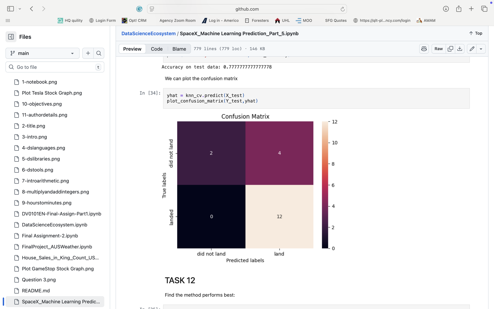
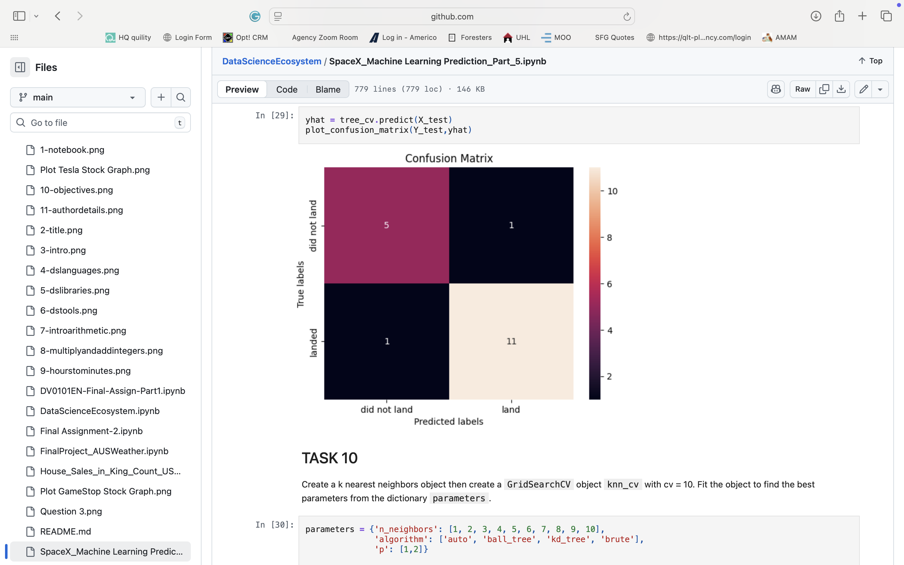
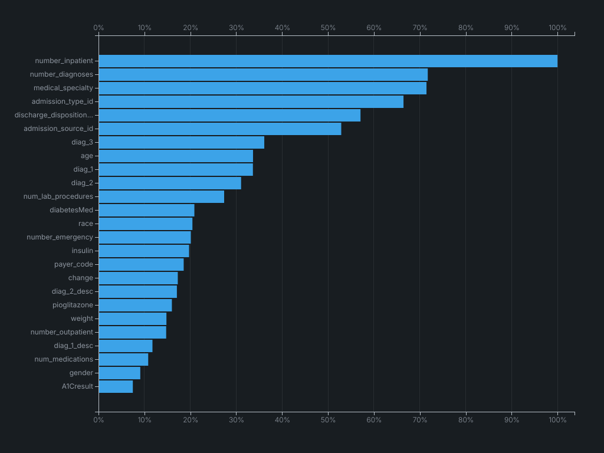

# 🧠 Jamie Christian — Data Science Portfolio (2025 Edition)


Welcome to my **Data Science Portfolio**, where I showcase my analytical and technical capabilities through a mix of **real-world datasets**, **machine learning models**, and **executive summaries**.  

Each project highlights end-to-end workflows — from **data wrangling** and **feature engineering** to **model building**, **evaluation**, and **insight communication**.

> 🎯 **Goal:** Deliver business-ready insights through reproducible analytics and clean storytelling.  
> 🧰 **Core Stack:** Python, Pandas, NumPy, Scikit-Learn, Matplotlib, Plotly, SQL, Power BI, JupyterLab.

---

## 🗂 Repository Structure

```
data-science-portfolio/
├── notebooks/          # Jupyter notebooks for analysis, ML, and EDA
├── Visuals/            # Charts, model outputs, and confusion matrices
├── data_files/         # Raw and cleaned datasets
├── reports_package/    # Executive summary PDFs (1-page reports)
├── docs/               # Documentation and supporting materials
└── README.md           # You are here
```

---

## 🚀 Featured Projects

| Project | Description | Deliverable |
|----------|--------------|--------------|
| 🚀 **SpaceX Machine Learning Prediction** | Predicts Falcon 9 first stage landing success using ML models. | [Executive Summary (PDF)](reports_package/SpaceX_ML_Prediction_Summary.pdf) |
| 🌦️ **AUSWeather Prediction Project** | Forecasts rain occurrence using meteorological data. | [Executive Summary (PDF)](reports_package/AUSWeather_Project_Summary.pdf) |
| 🏠 **House Sales in King County, USA** | Predicts house prices using regression and feature analysis. | [Executive Summary (PDF)](reports_package/House_Sales_Summary.pdf) |

---

## 📊 Visuals & Assets

See the [`Visuals/`](Visuals) directory for all supporting images, charts, and model plots.  

| Model / Topic | Visualization |
|----------------|----------------|
| **SVM Classifier** |  |
| **Decision Tree** |  |
| **Elastic-Net Classifier** |  |
| **Tesla Stock Study** |  |

---

## 📓 Notebooks Overview

The [`notebooks/`](notebooks) folder contains fully documented Jupyter notebooks covering topics such as:
- **Exploratory Data Analysis (EDA)**
- **Machine Learning Pipelines**
- **API Integration & Web Scraping**
- **SQL Queries & Data Wrangling**

Example notebooks:
- `SpaceX_Machine Learning Prediction_Part_5.ipynb`
- `FinalProject_AUSWeather.ipynb`
- `House_Sales_in_King_Count_USA.ipynb`

Each notebook follows the format:
> *Problem → Data → Method → Results → Insights.*

---

## 🧾 Executive Summaries

The [`reports_package/`](reports_package) folder contains concise one-page reports for quick review:
- [🚀 SpaceX Machine Learning Prediction](reports_package/SpaceX_ML_Prediction_Summary.pdf)
- [🌦️ AUSWeather Project](reports_package/AUSWeather_Project_Summary.pdf)
- [🏠 House Sales in King County, USA](reports_package/House_Sales_Summary.pdf)

These are business-friendly summaries highlighting dataset, approach, key results, and impact.

---

## ⚙️ Getting Started

### Clone & Run
```bash
git clone https://github.com/JamieChristian22/data-science-portfolio.git
cd data-science-portfolio
python -m venv .venv
source .venv/bin/activate  # Windows: .venv\Scripts\activate
pip install -r requirements.txt
jupyter lab
```

### Recommended Tools
- JupyterLab / VS Code
- Power BI (for dashboards)
- Python 3.10+  
- Pandas, Scikit-Learn, Plotly, Matplotlib, Seaborn

---

## 🧠 Skills Demonstrated

| Category | Tools / Techniques |
|-----------|--------------------|
| **Data Preparation** | Pandas, NumPy, Power Query |
| **Visualization** | Matplotlib, Plotly, Power BI |
| **Modeling** | Scikit-Learn (Regression, Classification) |
| **Automation** | Python Scripts, API, Web Scraping |
| **Documentation** | Markdown, ReportLab, Executive Summaries |

---

## 🧭 Roadmap

- [ ] Add interactive Streamlit dashboard  
- [ ] Integrate Power BI visuals  
- [ ] Include model comparison notebook  
- [ ] Expand executive summaries into 2-page reports  

---

## 📜 License

This repository is licensed under the **MIT License**.  
© 2025 Jamie Christian. All rights reserved.

---

## 🤝 Connect

💼 [LinkedIn](https://linkedin.com/in/jamiechristiananalytics)  
📂 [GitHub](https://github.com/JamieChristian22)  
📧 *Open to Data Science, and ML collaboration opportunities.*

---

> “Turning data into insight — and insight into intelligent action.”  
> — **Jamie Christian**
